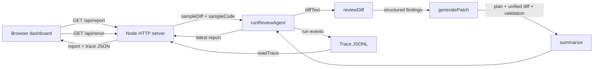
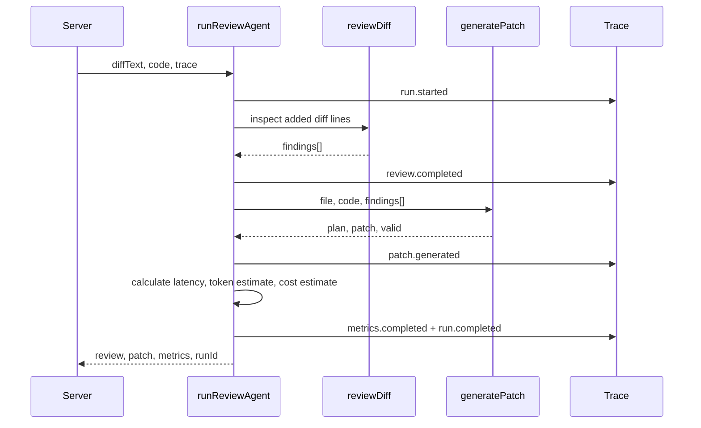
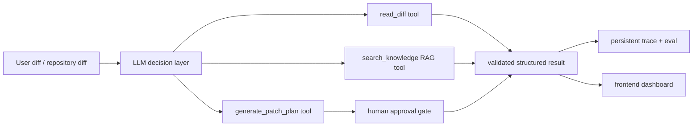

# Agent 0518 Architecture

## Purpose

`agent-0518` is a frontend diff review application. Given a sample Git diff and source code, it produces structured review findings, a patch plan, a unified diff, trace events, metrics, and eval results.

This document describes the current implementation, not the intended future architecture. The current reviewer is deterministic rule-based code. It is not yet an LLM-powered Agent.

## Current Data Flow



## Runtime Sequence

1. `src/server.js` starts an HTTP server on port `5118`.
2. At startup, the server runs one review against `src/sampleDiff.js` and stores it in memory as `latest`.
3. The dashboard requests `/api/report` to get `latest` and the JSONL trace.
4. When the user clicks `Run Review`, the dashboard requests `/api/rerun`.
5. The server runs the same review again and returns the new report and trace.
6. The frontend renders metrics, findings, patch plan, patch text, and trace events.

## Agent Pipeline



## Module Ownership

| Module | Responsibility | Input | Output |
| --- | --- | --- | --- |
| `src/server.js` | HTTP API and static file service | Browser request | `{ latest, trace }` JSON or static asset |
| `src/agent.js` | Orchestration and trace event ordering | `diffText`, `code`, `trace` | `runId`, `review`, `patch`, `metrics` |
| `src/review.js` | Rule-based review of added diff lines | Git diff text | `summary`, `findings[]` |
| `src/patch.js` | Patch-plan generation, patch generation, patch validation | file, source code, findings | `plan`, `patch`, `valid` |
| `src/trace.js` | JSONL trace write/read | event type, payload | one persisted event per line |
| `src/metrics.js` | Latency and estimated cost summary | start time, findings, patch | `latencyMs`, token/cost estimate |
| `src/eval.js` | Regression checks over the sample case | trace path | pass/fail report |
| `public/app.js` | Dashboard rendering and rerun action | API response | DOM updates |

## Structured Contracts

### Finding

```js
{
  severity: "high" | "medium" | "low",
  category: "error-handling" | "accessibility" | "security" | "testing",
  file: "src/LoginButton.jsx",
  line: 7,
  message: "Async 调用缺少错误处理。",
  suggestion: "增加 try/catch 和失败状态。"
}
```

### Patch Plan

```js
{
  file: "src/LoginButton.jsx",
  risk: "requires-review" | "low",
  steps: [{ category, reason, action }]
}
```

### Trace Event

```js
{
  ts: "2026-08-10T00:00:00.000Z",
  type: "run.started" | "review.completed" | "patch.generated" | "metrics.completed" | "run.completed",
  runId: "run_...",
  // event-specific payload
}
```

## Current Review Rules

`reviewDiff()` only inspects added lines in the diff. It currently creates findings for:

- `await` without a nearby `try` or `catch`: error handling.
- `` without `alt`: accessibility.
- `localStorage.setItem`: token-storage security review.
- any changed code without a `.test.` or `.spec.` file in the diff: testing.

## Current Acceptance Checks

`npm test` runs five checks:

1. Finds error handling issue.
2. Finds accessibility issue.
3. Finds missing test issue.
4. Generates a syntactically valid unified diff shape.
5. Marks high-severity output as `requires-review`.

## Important Boundaries

- The review decision is hard-coded pattern matching, not a model decision.
- `reviewDiff()` and `generatePatch()` are direct function calls, not a generic Tool Calling registry.
- The server only analyzes the bundled sample diff; it does not accept uploaded or repository diffs.
- Patch generation is intentionally a proposal only. It does not write to the reviewed source file.
- `Trace` clears the trace file on construction. This is suitable for a demo, not persistent production observability.
- Token and cost metrics are estimates based on serialized output size, not provider usage data.

## V2 Upgrade Map

The next implementation should preserve the existing contracts and replace the decision layer:



Upgrade order:

1. Keep the current `Finding` and `Patch Plan` shapes as Pydantic/Zod schemas.
2. Move review and patch functions behind named tools with argument validation and timeout handling.
3. Add a model provider that chooses tools and returns structured output.
4. Add RAG citations to each rule-based or model-based finding.
5. Add a human approval API before any patch can be applied.
6. Make trace persistent and record provider/model, prompt version, tool arguments, error, latency, and actual token usage.

## Demo Narrative

"A user opens the dashboard and runs a frontend diff review. The application identifies structured issues, proposes a patch plan without changing source code, records the complete execution trace, displays latency and estimated cost, and runs regression checks to prevent review quality from silently degrading."
