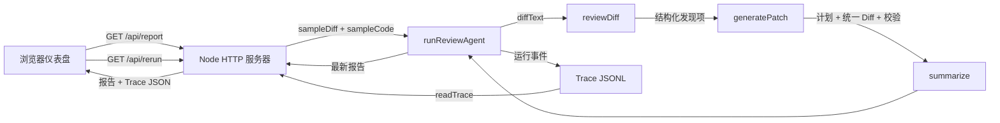
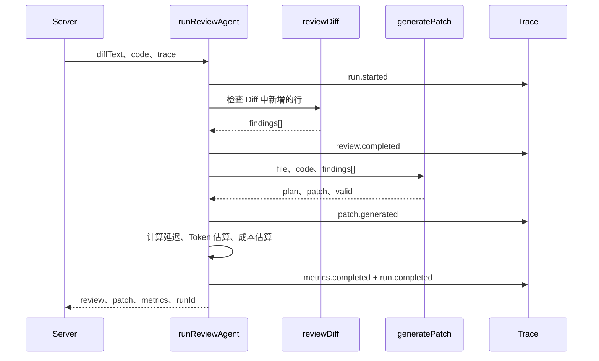
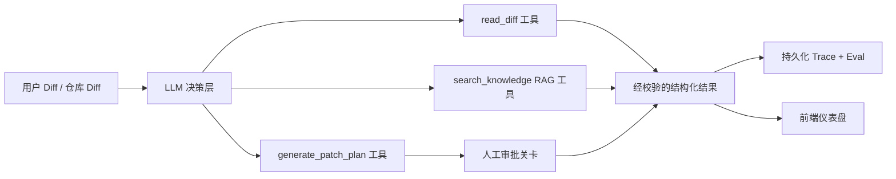

# Agent 0518 架构

## 目标

`agent-0518` 是一个前端 Diff 代码审查应用。它接收示例 Git Diff 和源代码，并产出结构化审查结论、补丁计划、统一 Diff、追踪事件、指标和评估结果。

本文档描述的是当前实现，而非未来的目标架构。当前审查器由确定性的规则代码驱动，尚不是由 LLM 驱动的 Agent。

## 当前数据流



## 运行时序

1. `src/server.js` 在端口 `5118` 启动 HTTP 服务器。
2. 启动时，服务器会基于 `src/sampleDiff.js` 运行一次审查，并将结果作为 `latest` 保存在内存中。
3. 仪表盘请求 `/api/report`，获取 `latest` 和 JSONL Trace。
4. 用户点击 `Run Review` 后，仪表盘会请求 `/api/rerun`。
5. 服务器再次运行相同审查，并返回新的报告和 Trace。
6. 前端渲染指标、发现项、补丁计划、补丁文本和追踪事件。

## Agent 管道



## 模块职责

| 模块 | 职责 | 输入 | 输出 |
| --- | --- | --- | --- |
| `src/server.js` | HTTP API 与静态文件服务 | 浏览器请求 | `{ latest, trace }` JSON 或静态资源 |
| `src/agent.js` | 编排流程与 Trace 事件顺序 | `diffText`、`code`、`trace` | `runId`、`review`、`patch`、`metrics` |
| `src/review.js` | 基于规则审查 Diff 中新增的行 | Git Diff 文本 | `summary`、`findings[]` |
| `src/patch.js` | 生成补丁计划、补丁并校验补丁 | 文件、源代码、发现项 | `plan`、`patch`、`valid` |
| `src/trace.js` | JSONL Trace 的写入与读取 | 事件类型、负载 | 每行一个持久化事件 |
| `src/metrics.js` | 延迟和预估成本汇总 | 开始时间、发现项、补丁 | `latencyMs`、Token/成本估算 |
| `src/eval.js` | 对示例案例执行回归检查 | Trace 路径 | 通过/失败报告 |
| `public/app.js` | 仪表盘渲染与重新执行操作 | API 响应 | DOM 更新 |

## 结构化契约

### Finding（发现项）

```js
{
  severity: "high" | "medium" | "low",
  category: "error-handling" | "accessibility" | "security" | "testing",
  file: "src/LoginButton.jsx",
  line: 7,
  message: "Async 调用缺少错误处理。",
  suggestion: "增加 try/catch 和失败状态。"
}
```

### Patch Plan（补丁计划）

```js
{
  file: "src/LoginButton.jsx",
  risk: "requires-review" | "low",
  steps: [{ category, reason, action }]
}
```

### Trace Event（追踪事件）

```js
{
  ts: "2026-08-10T00:00:00.000Z",
  type: "run.started" | "review.completed" | "patch.generated" | "metrics.completed" | "run.completed",
  runId: "run_...",
  // 事件专属负载
}
```

## 当前审查规则

`reviewDiff()` 仅检查 Diff 中新增的行。目前会在以下情况创建发现项：

- `await` 附近缺少 `try` 或 `catch`：错误处理。
- `` 缺少 `alt`：无障碍访问。
- `localStorage.setItem`：Token 存储的安全性审查。
- 有代码变更但 Diff 中没有 `.test.` 或 `.spec.` 文件：测试缺失。

## 当前验收检查

`npm test` 会运行五项检查：

1. 发现错误处理问题。
2. 发现无障碍访问问题。
3. 发现缺失测试的问题。
4. 生成语法有效的统一 Diff 格式。
5. 将高严重性输出标记为 `requires-review`。

## 重要边界

- 审查决策来自硬编码的模式匹配，而非模型决策。
- `reviewDiff()` 和 `generatePatch()` 是直接函数调用，并非通用的 Tool Calling 注册表。
- 服务器只分析内置示例 Diff，不能接收上传的 Diff 或仓库 Diff。
- 补丁生成刻意只作为提案；不会写入被审查的源文件。
- `Trace` 在构造时清空追踪文件。这适合 Demo，不适合作为生产环境的持久化可观测性方案。
- Token 和成本指标基于序列化输出大小进行估算，并非提供商的实际用量数据。

## V2 升级路线图

下一版实现应保留现有契约，并替换决策层：



升级顺序：

1. 保持当前 `Finding` 与 `Patch Plan` 的数据形状，并将其定义为 Pydantic/Zod schema。
2. 将审查和补丁函数封装为具名工具，并加入参数校验与超时处理。
3. 接入模型提供商，由模型选择工具并返回结构化输出。
4. 为每个基于规则或模型生成的发现项增加 RAG 引用。
5. 在任何补丁能够被应用前，增加人工审批 API。
6. 将 Trace 改为持久化存储，并记录提供商/模型、提示词版本、工具参数、错误、延迟和实际 Token 用量。

## Demo 叙事

“用户打开仪表盘，运行一次前端 Diff 代码审查。应用识别出结构化问题，在不修改源代码的前提下提出补丁计划，记录完整执行 Trace，展示延迟和预估成本，并运行回归检查以避免审查质量在无感知的情况下退化。”
