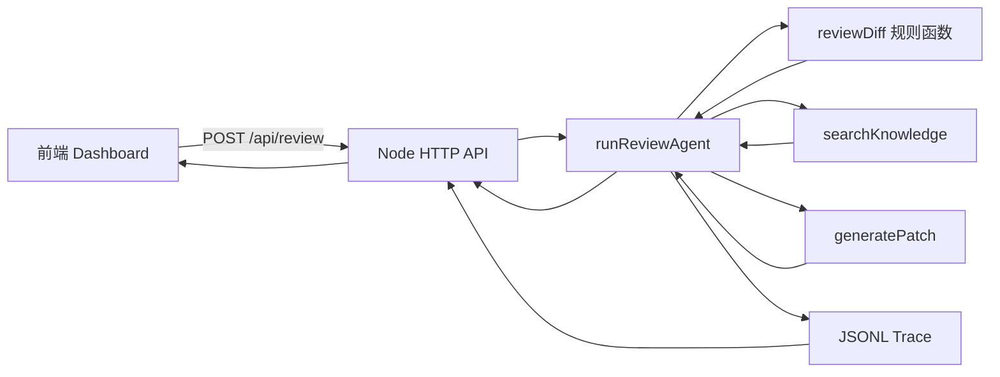
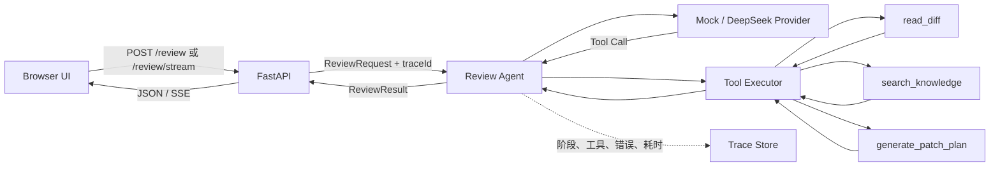

# Frontend Review Agent 架构说明

## 1. agent-0518 当前状态

`agent-0518` 是一个 Node.js 离线前端审查 Demo。浏览器提交 Git diff，服务端依次执行固定规则审查、知识检索、补丁计划、审批和 trace 记录。它已经具备 Agent 应用的外形，但决策顺序由代码写死，没有模型 Provider、参数 Schema、工具容错和流式事件。

## 2. 各层职责

| 层 | 当前实现 | 应承担的职责 | 不应该承担的职责 |
| --- | --- | --- | --- |
| 前端 | `public/app.js` | 收集输入、展示阶段事件和最终结果 | 自己执行审查规则或保存密钥 |
| API | `src/server.js` | HTTP 协议、校验、错误映射、SSE | 直接写死 Agent 决策流程 |
| Agent | `src/agent.js` | 管理上下文、选择工具、汇总结构化结果 | 直接读写任意文件或绕过工具边界 |
| Tool | `review.js`、`rag.js`、`patch.js` | 单一能力、明确参数、可超时和可观测 | 隐式共享全局状态 |
| Trace | `src/trace.js` | 用 `traceId` 记录模型、工具、耗时、错误 | 保存 API Key 或完整敏感输入 |

## 3. 目标架构

第 1 周结束后的系统由 FastAPI 提供 API 与 SSE，Provider 层隔离 Mock/DeepSeek，Agent 只通过 Tool Registry 调用能力，所有输入输出由 Pydantic 校验。

## 4. 一次请求的数据流

1. 前端发送 `diff_text` 和可选的 `code`。
2. FastAPI 用 `ReviewRequest` 校验长度与必填字段，并生成 `traceId`。
3. Agent 记录 `run.started`，让 Provider 决定或确认执行步骤。
4. Agent 通过 Tool Executor 调用 `read_diff`，参数先经过 Pydantic 校验。
5. Agent 根据 finding 类别调用 `search_knowledge`，获取带来源的规范。
6. Agent 调用 `generate_patch_plan`，生成可审查但不自动应用的计划。
7. Provider 或 Agent 将结果校验为稳定的 `ReviewResult`。
8. Trace 记录每个阶段的开始、成功、失败、重试和降级；API 返回同一个 `traceId`。
9. SSE 模式把上述事件边执行边推送给前端，普通 `/review` 只返回最终 JSON。

## 5. 关键边界

- API Key 只存在于服务端环境变量，绝不下发浏览器。
- Patch 只生成计划，不自动改业务仓库。
- Tool 参数不可信，必须校验；Tool 执行必须有超时。
- 模型 JSON 不可信，必须再次通过 Pydantic 校验。
- “思考阶段”只展示可公开的运行阶段，不展示模型私有推理内容。

