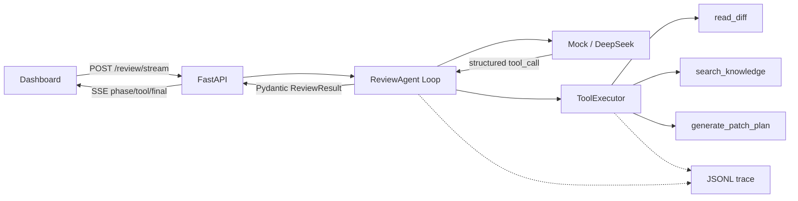

# Frontend Review Agent 架构

## 关键设计

- FastAPI 只负责协议、Schema、SSE 和错误映射。
- Provider 只负责模型回合，不直接执行工具。
- Agent 管理消息、最大轮次、工具结果回传和最终结果。
- ToolExecutor 负责白名单、参数校验、超时、重试、降级和 trace。
- Pydantic 同时校验 API 输入、工具参数、模型 JSON 和最终响应。
- Dashboard 只接收公开阶段事件，DeepSeek API Key 永远留在服务端。

