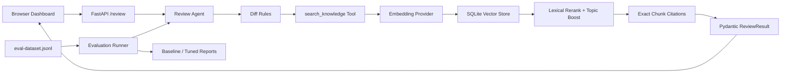

# Frontend Review RAG Agent 架构

## 关键约束

- Agent 只有检测到 finding 后才调用知识检索，每个调用都有 tool run 状态。
- finding 没有真实 citation 时不会进入最终结果。
- citation.quote 由 chunk 截取，不由模型生成。
- baseline 与 tuned 使用相同数据集；差异仅来自规则覆盖和检索配置。
- 生产迁移时保持 Retriever 接口不变，替换 Embedding Provider 与 Vector Store。
