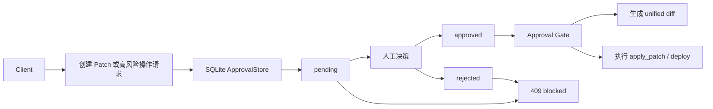

# Day 15 人工审批架构

```mermaid
flowchart LR
    Client["Client"] --> Request["创建 Patch 或高风险操作请求"]
    Request --> Store["SQLite ApprovalStore"]
    Store --> Pending["pending"]
    Pending --> Human["人工决策"]
    Human --> Approved["approved"]
    Human --> Rejected["rejected"]
    Approved --> Gate["Approval Gate"]
    Gate --> Patch["生成 unified diff"]
    Gate --> Operation["执行 apply_patch / deploy"]
    Rejected --> Blocked["409 blocked"]
    Pending --> Blocked
```

## 约束

- 决策只能从 `pending` 转为 `approved` 或 `rejected`，不能二次修改。
- Patch 在批准前不会生成，生成后也不会自动写入源码。
- 高风险操作结果使用原子更新保存，同一审批不能重复执行。
- API 不返回审批负载中的完整源码，只返回摘要。
