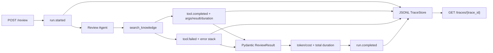

# Day 16 Trace 架构

```mermaid
flowchart LR
    API["POST /review"] --> Run["run.started"]
    Run --> Agent["Review Agent"]
    Agent --> Tool["search_knowledge"]
    Tool --> Success["tool.completed + args/result/duration"]
    Tool --> Failure["tool.failed + error stack"]
    Success --> Output["Pydantic ReviewResult"]
    Failure --> Output
    Output --> Usage["token/cost + total duration"]
    Usage --> Done["run.completed"]
    Run --> Trace["JSONL TraceStore"]
    Success --> Trace
    Failure --> Trace
    Done --> Trace
    Trace --> Query["GET /traces/{trace_id}"]
```

## 约束

- 每次请求生成独立 `trace_id`，所有事件通过它关联。
- 模型、Prompt 版本、工具参数和结果摘要均结构化记录。
- 当前 token 是近似值，本地规则模型 cost 为 0；真实 Provider 可写入真实 usage。
- 工具异常不静默吞掉，Trace 保存异常类型、消息和 stack。
