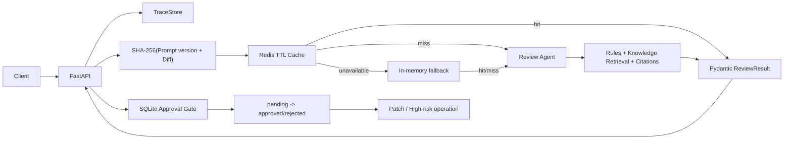

# Day 17 工程化架构

## 选型边界

- Redis 只缓存重复 Diff 审查，因为这是当前明确存在且可量化的重复计算。
- Prompt 版本进入 key，升级 Prompt 后不会误用旧结果。
- Redis 断连时 fail-open 到带 TTL 的进程内缓存，核心审查能力保持可用。
- 缓存命中仍生成新 Trace，不复用历史 `trace_id`。
- 会话和限流尚无真实需求，当前不引入。
