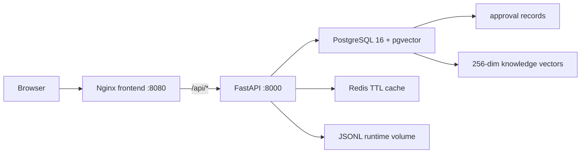

# Day 18 Compose 部署架构

## 边界

- Nginx 只负责静态资源和反向代理。
- FastAPI 负责 Agent、审批、Trace 和结构化 API。
- PostgreSQL 同时保存审批数据与 pgvector 知识向量。
- Redis 只缓存相同 Diff + Prompt 版本的审查结果。
- 本地 pytest 默认继续使用 SQLite 和内存缓存，保证测试快速、确定。
