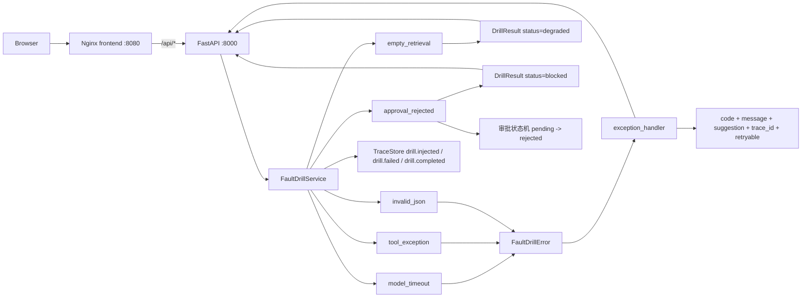

# Day 19 故障演练架构

## 边界

- 演练只注入**可控**故障，不触发真实外部依赖，结果确定、可重复。
- 硬失败（模型超时、工具异常、JSON 失败）走 fail-closed：抛 `FaultDrillError`，由统一 `exception_handler` 渲染，不产出任何结果。
- 可降级/阻断场景（检索为空、审批拒绝）返回 `200` + `status`，保留业务语义，不计入服务错误。
- 每个场景有固定的错误码与 HTTP 状态码，作为前后端契约被参数化测试锁定。
- 每次演练写入 Trace（`drill.injected` / `drill.failed` / `drill.completed`），并返回 `trace_id` 供排查串联。
- 页面只依赖统一错误结构展示 `code`、中文说明、处理建议和 `traceId`，不解析各接口的私有格式。
