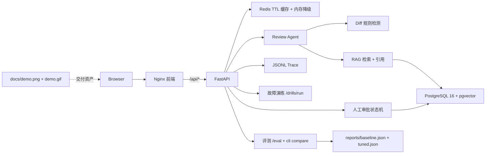

# Day 20 整合架构

请求链路：浏览器提交 Diff，FastAPI 创建 Trace 并查 Redis 缓存；未命中时 Review Agent 执行规则检测与知识检索（素材存于 PostgreSQL + pgvector），返回 Pydantic 校验后的 JSON。高风险操作进入审批状态机，不会直接改源码或部署。

## 边界

- 所有能力收敛到**一个仓库、一条命令**：`docker compose up --build -d` 起前端、API、数据库、缓存四个服务。
- Agent 行为由本地确定性规则编排，便于评测与故障注入；真实 LLM/Embedding 接入后不改 Trace API。
- 缓存、审批、Trace、故障演练各自独立成模块，互不成为正确性依赖。
- 评测以固定数据集对比 Baseline/Tuned，指标只用于回归，不外推线上质量。
- 部署契约（四服务、健康检查、env 必填项、Nginx 反代 `/api`）与文档/演示资产由测试守护，防止漂移。
- 本地默认回退 SQLite 向量库/审批库和内存缓存，保证无外部依赖也能跑通核心路径。
