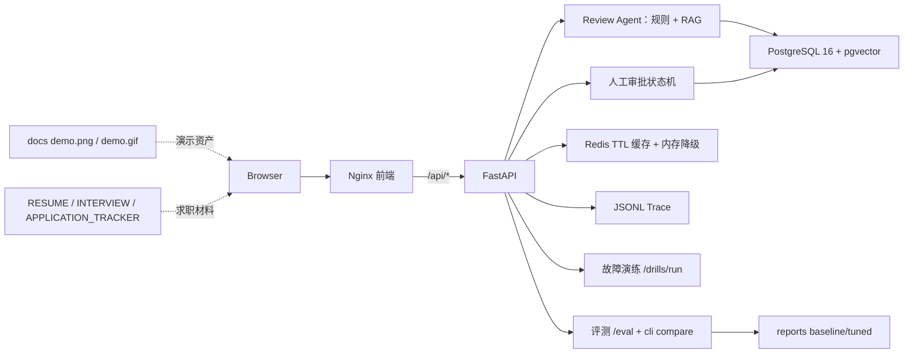

# 作品集交付架构（Portfolio）

## 交付边界

- **可运行**：`docker compose up --build -d` 一条命令起前端、API、数据库、缓存，四个服务均带健康检查。
- **可演示**：`docs/demo.png` 与 `docs/demo.gif` 作为演示资产，页面覆盖审查、审批、故障演练三条主链路。
- **可评测**：固定 12 个前端审查 Case，`reports/` 保存 Baseline/Tuned 结果，`python -m app.cli compare` 可复现。
- **可解释**：每次运行生成 `traceId`，记录模型、Prompt 版本、工具入参/结果、token/cost、耗时与错误；故障返回统一错误结构。
- **可降级**：检索为空降级不伪造引用，Redis 断连回退内存缓存，高风险操作经审批状态机阻断。
- **可沉淀**：`RESUME.md`、`INTERVIEW.md`、`APPLICATION_TRACKER.md` 把工程能力转成求职材料。
- 指标基于小型确定性本地数据集，只用于回归比较，不代表线上大规模模型效果。
