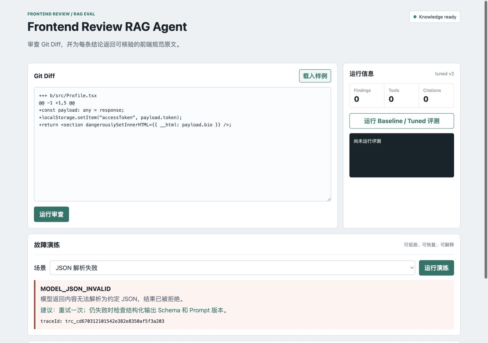
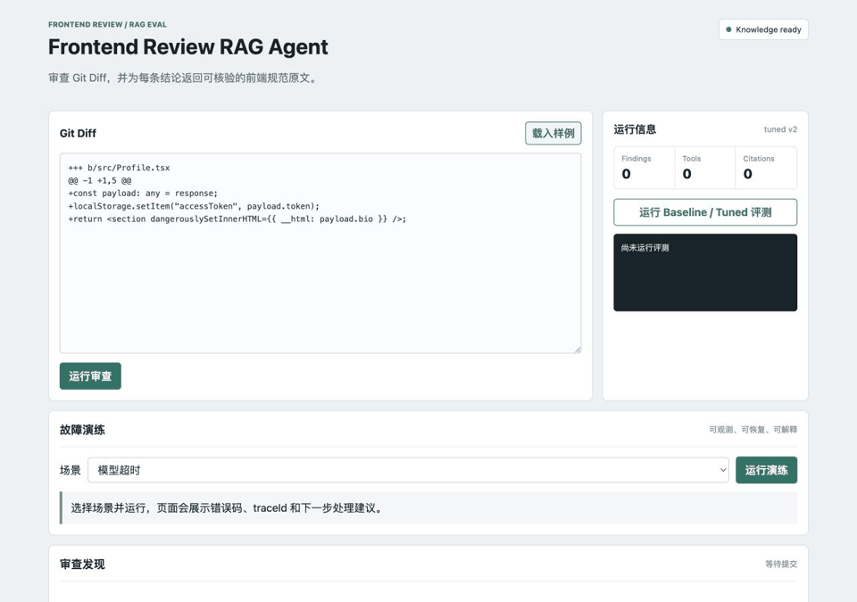
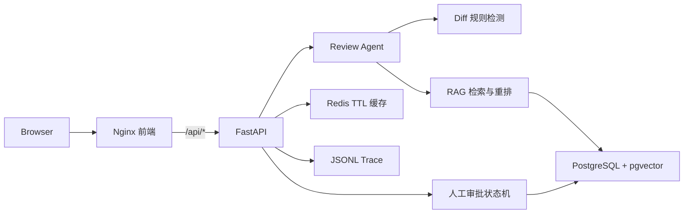

# Frontend Review Agent

一个面向前端 Git Diff 的可部署审查 Agent。它将规则检测、RAG 规范引用、人工审批、Trace、故障降级和自动评测整合为完整应用，而不是停留在对话 Demo。





## 能解决什么

- 审查 React、Vue、TypeScript、性能与安全问题，每条发现附带知识库原文引用。
- 对相同 Diff 缓存结果，减少重复计算；Redis 不可用时自动回退内存缓存。
- 生成 Patch 或执行部署前必须经过 `pending -> approved/rejected` 人工审批。
- 记录模型、Prompt 版本、工具输入/结果、token、cost、耗时、错误和 `traceId`。
- 可重复演练模型超时、工具异常、检索为空、JSON 失败和审批拒绝。

## 架构



请求链路：浏览器提交 Diff，FastAPI 创建 Trace 并检查 Redis；未命中时 Agent 执行规则与知识检索，返回 Pydantic 校验后的 JSON。高风险操作进入审批状态机，不会直接修改源文件或部署。

## 技术选型

| 模块 | 选择 | 原因 |
| --- | --- | --- |
| API 与 Schema | FastAPI + Pydantic | OpenAPI、参数校验、稳定 JSON 和错误处理简单直接 |
| Agent | Python 规则编排 + Tool/RAG | 行为可复现，适合做评测与故障注入 |
| 向量库 | PostgreSQL 16 + pgvector | 审批数据和向量统一持久化，后续可平滑扩展 |
| 缓存 | Redis + 内存降级 | 只缓存重复审查，组件职责明确 |
| 前端 | 原生 HTML/CSS/JS + Nginx | Demo 体积小，反向代理边界清楚 |
| 可观测性 | JSONL Trace | 本地可读，完整记录运行阶段和错误上下文 |
| 部署 | Docker Compose | 一条命令启动前端、API、数据库和 Redis |

## 快速运行

### Docker Compose

Windows PowerShell：

```powershell
Copy-Item .env.example .env
# 修改 .env 中的 POSTGRES_PASSWORD
docker compose up --build -d
docker compose ps
```

macOS / Linux：

```bash
cp .env.example .env
# 修改 .env 中的 POSTGRES_PASSWORD
docker compose up --build -d
docker compose ps
```

- 页面：`http://127.0.0.1:8080`
- API 文档：`http://127.0.0.1:8000/docs`
- 健康检查：`http://127.0.0.1:8000/health`

Windows PowerShell 和 macOS / Linux 通用：

```bash
docker compose down
```

### 本地开发

本地测试默认使用 SQLite 向量/审批库和内存缓存，不依赖外部服务。

Windows PowerShell：

```powershell
uv venv .venv
.\.venv\Scripts\Activate.ps1
uv pip install -r requirements.txt
python -m pytest -q
python -m uvicorn app.main:app --reload
```

macOS / Linux：

```bash
python3 -m venv .venv
source .venv/bin/activate
python -m pip install -r requirements.txt
python -m pytest -q
python -m uvicorn app.main:app --reload
```

访问 `http://127.0.0.1:8000`。完整配置及默认值见 [`.env.example`](./.env.example)。

## 评测结果

固定数据集包含 12 个真实前端审查 Case，覆盖 React、Vue、TypeScript、性能、安全和无问题样本。以下为仓库中 [`reports/baseline.json`](./reports/baseline.json) 与 [`reports/tuned.json`](./reports/tuned.json) 的实测结果。

| 指标 | Baseline | Tuned |
| --- | ---: | ---: |
| Case 通过率 | 33.33% | 100% |
| 问题命中率 | 45.45% | 100% |
| 引用正确率 | 27.27% | 100% |
| JSON 合法率 | 100% | 100% |
| 工具成功率 | 100% | 100% |
| 平均延迟 | 0.194 ms | 0.527 ms |

复现评测：

Windows PowerShell 和 macOS / Linux 通用：

```bash
python -m app.cli compare
```

这些指标基于小型确定性本地数据集，只用于回归比较，不代表线上大规模模型效果。

## 失败处理

| 故障 | API 行为 | 页面反馈 | 恢复方式 |
| --- | --- | --- | --- |
| 模型超时 | `504 MODEL_TIMEOUT` | 不展示残缺结果 | 重试、缩小 Diff 或切备用模型 |
| 工具异常 | `502 TOOL_EXECUTION_FAILED` | 停止无依据推断 | 按 trace 检查工具与依赖 |
| 检索为空 | `200 KNOWLEDGE_NOT_FOUND` | 明确标记降级，不伪造引用 | 调整关键词、过滤器或语料 |
| JSON 失败 | `502 MODEL_JSON_INVALID` | 拒绝无效模型结果 | 重试并检查 Schema/Prompt |
| 审批拒绝 | `200 APPROVAL_REJECTED` | 显示操作已阻断 | 修正风险后新建审批 |
| Redis 故障 | API 继续可用 | 标记缓存降级 | 自动使用进程内 TTL 缓存 |

运行单个演练：

Windows PowerShell：

```powershell
$body = @{ scenario = 'model_timeout' } | ConvertTo-Json
Invoke-RestMethod -Method Post -Uri http://127.0.0.1:8000/drills/run -ContentType 'application/json' -Body $body
```

macOS / Linux：

```bash
curl -X POST http://127.0.0.1:8000/drills/run \
  -H 'Content-Type: application/json' \
  -d '{"scenario":"model_timeout"}'
```

## 关键目录

```text
app/             FastAPI、Agent、RAG、审批、Trace、缓存与故障演练
frontend/        Nginx 托管的生产前端
data/            评测数据集和本地开发数据
reports/         Baseline/Tuned 评测报告
tests/           API、审批、缓存、Trace、部署与故障测试
docker/          前端/API 镜像定义
docs/            Demo 截图与 GIF
```

更细的数据边界见 [`ARCHITECTURE.md`](./ARCHITECTURE.md)。

## 求职材料

- [`RESUME.md`](./RESUME.md)：AI 前端、AI 应用全栈、Agent 应用开发三个岗位版本。
- [`INTERVIEW.md`](./INTERVIEW.md)：10 个核心面试题及 60-90 秒回答框架。
- [`APPLICATION_TRACKER.md`](./APPLICATION_TRACKER.md)：岗位筛选、每日精投节奏和跟进表。
